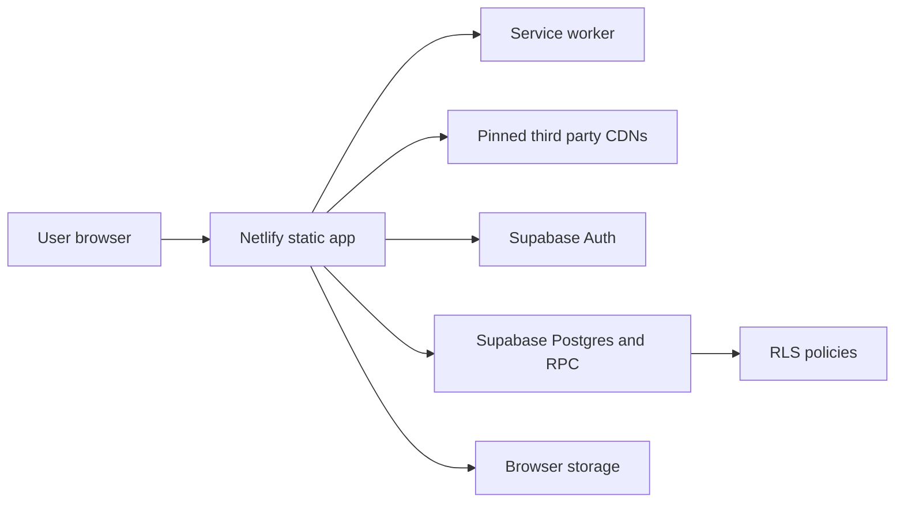

# Star Paper Production Threat Model

## Executive summary

Star Paper's production security boundary is a static Netlify browser app talking directly to Supabase Auth, Supabase Postgres, and Supabase Realtime. The highest-impact risks are cross-tenant data exposure through Supabase RLS/RPC mistakes, invite-code guessing, browser XSS that can read Supabase sessions, and third-party script compromise. This repo now hardens the highest-risk source controls, but the live Supabase project still must run the updated `schema.sql` before database-side mitigations are production-enforced.

## Scope and assumptions

In scope: `index.html`, public landing HTML, `app.boot-*.js`, `app.root-shell.js`, `app.js`, `supabase.js`, `sw.js`, `_headers`, `_redirects`, `.netlifyignore`, `scripts/preflight.mjs`, `schema.sql`, and production-path docs/tests.

Out of scope for this pass: retired `backend/`, dependency vendoring cleanup, live Supabase inspection, and generated `dist/` migration.

Assumptions:

- Netlify serves the repository root using `netlify.toml` with `publish = "."`.
- Supabase Auth and RLS are the authoritative authorization boundary.
- The Supabase anon key in `supabase.js` is public by design; service-role credentials must never appear in browser-delivered files.
- Star Paper is multi-user and team-scoped, so team membership is tenant boundary state.

Open questions that would change risk ranking:

- Whether the live Supabase project has already applied the latest `schema.sql`.
- Whether production uses extra edge controls outside this repo.
- Whether team invite codes are shared publicly or only through trusted channels.

## System model

### Primary components

- Static browser shell: `index.html`, public landing pages, app bundles, `app.root-shell.js`, styles, service worker.
- Cloud integration layer: `supabase.js` creates the Supabase browser client, handles auth/session bootstrap, team workspace resolution, data sync, and realtime.
- Database contract: `schema.sql` defines tables, RLS policies, and SECURITY DEFINER RPCs.
- Deploy guard: `scripts/preflight.mjs` enforces root HTML, cache/version, CSP, route, secret-scan, RLS, invite-code, SRI, and sink invariants.

### Data flows and trust boundaries

- Internet user -> Netlify static shell: HTML, JS, CSS, service worker. Controls: CSP without script `unsafe-inline`, no-cache shell headers, root HTML allowlist, SRI for classic third-party scripts, and self-hosted runtime styles/fonts where feasible.
- Browser shell -> Supabase Auth: credentials, OAuth callback state, refresh/session artifacts. Controls: Supabase PKCE, browser storage namespace, logout/session cleanup.
- Browser shell -> Supabase Postgres/RPC: bookings, expenses, team membership, messages, profile data. Controls: RLS, actor checks, authenticated RPC grants, team role permissions.
- Browser shell -> third-party CDNs: Supabase SDK, Sentry, Chart.js, and jsPDF. Controls: pinned versions, SRI where browser-supported for classic scripts, CSP source allowlists. Globe runtime modules, land topology, brand fonts, and Phosphor icon CSS/fonts are local assets under `assets/vendor/` and `assets/world-atlas/`.
- Browser shell -> local browser storage: UI state, retry transport, Supabase session storage. Controls: account/workspace scoping and XSS reduction; not a confidentiality boundary.

#### Diagram

## Assets and security objectives

| Asset | Why it matters | Security objective |
| --- | --- | --- |
| Supabase auth sessions | Let the browser read/write user data | Confidentiality, integrity |
| Team membership and invite codes | Defines tenant access | Confidentiality, integrity |
| Business records | Bookings, finance, reports, tasks, profiles | Confidentiality, integrity, availability |
| RLS policies and RPCs | Enforce data isolation because the client is public | Integrity |
| Static deploy surface | Anything in root can be published | Confidentiality |
| Third-party scripts | Run with first-party browser privileges | Integrity, confidentiality |

## Attacker model

### Capabilities

- Anonymous internet user can load public pages and inspect all browser-delivered code.
- Authenticated user can call Supabase RPCs with the public anon key and their own user JWT.
- Malicious team member can create hostile names, messages, finance text, and uploaded image data.
- Network or supply-chain attacker may attempt to tamper with third-party CDN resources.

### Non-capabilities

- No assumed service-role key, database admin access, Netlify admin access, or ability to bypass Supabase RLS directly.
- No live production SQL execution from this repo-only pass.
- No assumed compromise of Netlify atomic deploy infrastructure.

## Entry points and attack surfaces

| Surface | How reached | Trust boundary | Notes | Evidence |
| --- | --- | --- | --- | --- |
| Public HTML shell | Browser navigation | Internet -> Netlify | Root HTML is allowlisted and preflight-gated | `netlify.toml`, `.netlifyignore`, `scripts/preflight.mjs` |
| Supabase browser client | `supabase.js` | Browser -> Supabase | Public anon key, authenticated user JWTs | `supabase.js` |
| Team join RPC | `join_team_by_code` | Authenticated user -> SECURITY DEFINER RPC | Invite code is a bearer token | `schema.sql` |
| App rendering | `innerHTML`, templates, image URLs | Cloud/browser data -> DOM | User data must be escaped or constrained | `app.js` |
| File/image uploads | Receipt, proof, avatar inputs | Local file -> browser storage/Supabase rows | Now limited by type and size | `index.html`, `app.js` |
| Third-party resources | CDN scripts | CDN -> app origin execution | SRI added where feasible | `index.html`, `app.root-shell.js`, `supabase.js` |

## Top abuse paths

1. Attacker guesses, obtains, or direct-selects a team invite code -> joins or shares access as a viewer -> reads team records and member metadata. Mitigated in source by 32-hex codes, malformed-code rejection, admin-only invite-code RPC disclosure, and removal of direct `teams.invite_code` SELECT; live DB migration still required.
2. Attacker stores malicious text or image URL -> app renders it through a dangerous sink -> browser session tokens are stolen. Mitigated by targeted sink cleanup, image URL normalization, upload limits, and preflight guardrails.
3. Team editor crafts a direct Supabase update -> moves team rows into a personal workspace or another team -> exfiltrates or removes shared data. Mitigated in source by immutable workspace-scope trigger guards and cloned-row team-copy behavior; live DB migration still required.
4. CDN asset changes unexpectedly -> malicious JS runs as first-party code -> Supabase sessions and app data are exposed. Mitigated with SRI for direct classic CDN scripts, pinned versions, CSP allowlists, and self-hosted globe/font/icon runtime assets; residual risk remains for the still-CDN Supabase/Sentry/Chart.js/jsPDF path.
5. Developer accidentally commits a service-role credential -> Netlify root publish serves it. Mitigated by preflight service-role env/JWT scanning and `.netlifyignore` doc/test exclusions.
6. Schema drift leaves live Supabase with older RLS/RPC rules -> browser client can still exercise stale access paths. Mitigated only after the live project runs the updated `schema.sql`.

## Threat model table

| Threat ID | Threat source | Prerequisites | Threat action | Impact | Impacted assets | Existing controls | Gaps | Recommended mitigations | Detection ideas | Likelihood | Impact severity | Priority |
| --- | --- | --- | --- | --- | --- | --- | --- | --- | --- | --- | --- | --- |
| TM-001 | Authenticated internet user | Weak/stale code exists, or invite code is exposed to non-admin members | Guess, obtain, direct-select, or share invite code and join team | Cross-tenant team data exposure as viewer | Team membership, business records | RLS, authenticated RPC, source now requires 32-hex codes and admin-only invite disclosure | Live DB may still hold old codes or old table grants until migration runs | Run updated `schema.sql`, rotate existing invite codes, verify `teams.invite_code` is not direct-selectable, monitor join failures | Query for non-32-hex invite codes; test direct select as viewer; log RPC errors | Medium | High | High |
| TM-002 | Malicious team member | Stored user-controlled data reaches DOM | Trigger XSS and steal browser-readable Supabase session | Account/team data compromise | Sessions, records, profile data | Escaping helpers, CSP without script `unsafe-inline`, `style-src-elem` self-only, `style-src-attr 'none'`, public landing document CSPs with no inline script/style allowance, DOM-rendered performance-map pins/panels/legends, globe hover cards/itinerary/detail sheets, report focus text, Today Board alerts, handcraft arrow icons, and team/currency modals, delegated task/report/globe/team/action controls, team chat `textContent` rendering, dashboard timeline and artist dropdown escaping, command-palette label/subtitle escaping, validated palette/nudge icon class tokens, service-worker auth-callback cache bypasses, new sink/input guardrails, externalized root boot/runtime scripts/style blocks | Existing `app.js` still has audited legacy `innerHTML` render paths | Continue sink-by-sink reduction and keep dynamic style-attribute emitters out of root/public HTML and root-shell boot code | Preflight sink, CSP, service-worker cache-bypass, inline-script, inline-style-block, and inline-style-attribute budgets; browser CSP reports if enabled | Medium | High | High |
| TM-003 | Malicious team editor | Permissive RLS update policy can see a team row and accept a personal/team target row, or team permission JSON is unconstrained | Reassign row scope or owner fields through direct Supabase update; create impossible role/permission combinations outside the UI model | Team data exfiltration, destructive removal from shared workspace, or privilege drift inside a team | Business records, team membership | Source now has immutable workspace-scope triggers, cloned team-copy inserts, and `team_members.permissions = public.team_role_permissions(role)` | Live DB may not have trigger or permission-shape guards until migration runs | Run updated `schema.sql`; verify updates changing `team_id`, `owner_id`, `user_id`, or role-derived permissions fail | Attempt direct update as team editor; inspect trigger and constraint definitions | Medium | High | High |
| TM-004 | CDN/supply-chain attacker | Third-party asset changes or CDN is compromised | Execute modified JS in app origin | Session/data exposure | Browser sessions, app integrity | Pinned versions, CSP, SRI on supported classic resources, self-hosted globe modules, local world-atlas data, brand fonts, and Phosphor icon CSS/fonts | Remaining CDN execution dependency for Supabase SDK, Sentry, Chart.js, and jsPDF | Keep SRI/preflight gates synchronized, optionally self-host the remaining CDN libraries, then remove unneeded CDN hosts from CSP | SRI failures, version inventory review | Low | High | Medium |
| TM-005 | Developer/operator mistake | Sensitive key committed to root | Netlify deploy publishes secret | Database takeover if service role leaks | Service-role credentials, database | `.netlifyignore`, preflight secret/JWT scan | Git history and old deploy permalinks are outside repo-only checks | Rotate any accidentally committed keys; delete old deploys | Preflight, repository secret scanning | Low | Critical | High |
| TM-006 | Stale live Supabase config | Source schema differs from production schema | Old RLS/RPC behavior remains active | Data exposure despite source fix | RLS policies, RPCs, tables | Source RLS, explicit `TO authenticated` policy scope, RPC, grant, and fixed `search_path = public, pg_temp` checks | Repo-only validation cannot inspect production | Run SQL migration and verification queries in Supabase | SQL checks for RLS, grants, function definitions | Medium | High | High |

## Criticality calibration

- Critical: service-role key disclosure, RLS disabled on business tables, arbitrary JavaScript execution with active sessions.
- High: cross-team data access, invite-code guessing that joins a team, SECURITY DEFINER RPC lacking actor checks.
- Medium: remaining third-party CDN execution dependency despite SRI and CSP, stored content reaching an audited sink with partial escaping, debug logging of user identity.
- Low: fingerprinting, stale docs, non-sensitive public metadata leaks.

## Focus paths for security review

| Path | Why it matters | Related Threat IDs |
| --- | --- | --- |
| `schema.sql` | RLS, team membership, invite codes, RPC grants, fixed SECURITY DEFINER search paths, workspace scope immutability | TM-001, TM-003, TM-005, TM-006 |
| `supabase.js` | Auth/session bootstrap, browser Supabase client, team flows | TM-001, TM-002, TM-003 |
| `app.js` | Main DOM rendering, uploads, receipts, profile/avatar handling | TM-002 |
| `index.html` | CSP and third-party bootstrap resource | TM-002, TM-004 |
| `app.boot-*.js` | Canonical route guards, prepaint flags, body theme, app/auth boot forcing | TM-002 |
| `app.root-shell.js` | Deferred third-party loaders, local/dev guards, critical root-shell actions, forgot-password wiring | TM-002, TM-004 |
| `scripts/preflight.mjs` | Deploy and security invariant gate | TM-003, TM-004, TM-005, TM-006 |
| `_headers` | Header-delivered CSP and anti-framing controls | TM-002, TM-004 |
| `sw.js` | Cached deploy surface and stale shell behavior | TM-002, TM-004 |

## Quality check

- Covered runtime entry points: public HTML, service worker, Supabase Auth, Supabase RPC/table access, uploads, DOM rendering, third-party resources.
- Covered trust boundaries: Internet to Netlify, browser to Supabase, browser to storage, CDN to browser.
- Separated production path from retired backend and dev tooling.
- Reflected user scope: repo-only, conservative, production path only.
- Residual risks are explicit: live Supabase drift, old Netlify deploy permalinks, browser-readable sessions in an SPA, audited `app.js` `innerHTML`, and the remaining CDN dependency for Supabase/Sentry/Chart.js/jsPDF resources.
